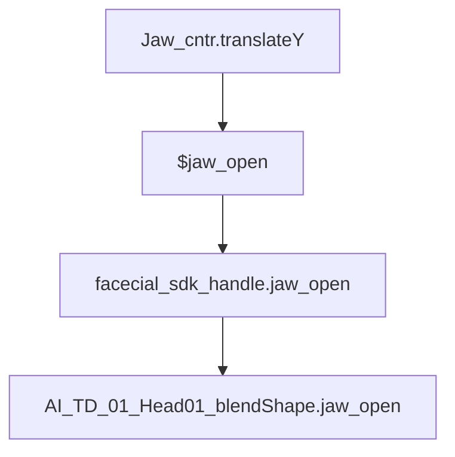

In expression node "facecial_dn_exp":
```code
float $jaw_drop = 0;//max(0,-Jaw_cntr.ty);
float $jaw_open = max(0,-Jaw_cntr.translateY/2.5);
float $jaw_up = max(0,Jaw_cntr.translateY/2.5);
float $jaw_l = max(0,Jaw_cntr.translateX/2.5);
float $jaw_r = max(0,-Jaw_cntr.translateX/2.5);
float $jaw_back = max(0,-Jaw_cntr.translateZ/2.5);
float $jaw_fwd = max(0,Jaw_cntr.translateZ/2.5);
float $mouth_l = max(0,Mouth_cntr.translateX/2.5);
float $mouth_r = max(0,-Mouth_cntr.translateX/2.5);
float $mouth_fwd = max(0,Mouth_cntr.translateZ/2.5);
float $nose_close = max(0,-Nose_cntr.translateX/2.5);
float $nose_open = max(0,Nose_cntr.translateX/2.5);
float $lwr_lip_up = max(0,LwrLip_cntr.translateY/2.5);
```

```code
//facecial_sdk_handle.jaw_open = $jaw_open;
facecial_sdk_handle.jaw_l = $jaw_l;
facecial_sdk_handle.jaw_r = $jaw_r;
facecial_sdk_handle.mouth_l = $mouth_l;
facecial_sdk_handle.mouth_r = $mouth_r;
facecial_sdk_handle.mouth_fwd = $mouth_fwd;
facecial_sdk_handle.nose_close = $nose_close;
facecial_sdk_handle.nose_open = $nose_open;

facecial_sdk_handle.jaw_open_1 = $jaw_open*(1-$sneer_l*0.0)*(1-$disgust_l*0.0)*(1-$nl_deep_l*0.0)*(1-$corner_up_l*0.104)*(1-$smile_l*0.0)*(1-$dimple_l*0.138)*(1-$stretch_l*0.0)*(1-$frown_l*0.154)*(1-$lwr_lip_dn_l*0.0)*(1-$lwr_lip_l_l*0.0)*(1-$lwr_lip_r_l*0.0)*(1-$chin_raise_dn_l*0.054)*(1-$funnel_dn_l*0.063)*(1-$o_dn_l*0.058)*(1-$pucker_dn_l*0.308)*(1-$tension_dn_l*0.138)*(1-$press_dn_l*0.0)*(1-$lip_in_dn_l*0.15)*(1-$upr_lip_dn_dn_l*0.0)*(1-$puff_dn_l*0.0)*(1-$suck_dn_l*0.0)*(1-$mouth_l*0.0)*(1-$mouth_r*0.0)*(1-$jaw_open*0.0)*(1-$jaw_l*0.0);

facecial_sdk_handle.jaw_open_2 = $jaw_open*(1-$sneer_l*0.0)*(1-$disgust_l*0.0)*(1-$nl_deep_l*0.146)*(1-$corner_up_l*0.0)*(1-$smile_l*0.083)*(1-$dimple_l*0.358)*(1-$stretch_l*0.096)*(1-$frown_l*0.179)*(1-$lwr_lip_dn_l*0.0)*(1-$lwr_lip_l_l*0.0)*(1-$lwr_lip_r_l*0.0)*(1-$chin_raise_dn_l*0.0)*(1-$funnel_dn_l*0.083)*(1-$o_dn_l*0.087)*(1-$pucker_dn_l*0.229)*(1-$tension_dn_l*0.0)*(1-$press_dn_l*0.0)*(1-$lip_in_dn_l*0.096)*(1-$upr_lip_dn_dn_l*0.0)*(1-$puff_dn_l*0.133)*(1-$suck_dn_l*0.0)*(1-$mouth_l*0.0)*(1-$mouth_r*0.0)*(1-$jaw_open*0.0)*(1-$jaw_l*0.0);
```

In expression node "facecial_bs_exp":
```code 
AI_TD_01_Head01_blendShape.jaw_up=facecial_sdk_handle.jaw_up;

AI_TD_01_Head01_blendShape.jaw_back=facecial_sdk_handle.jaw_back;

AI_TD_01_Head01_blendShape.jaw_clench=facecial_sdk_handle.jaw_clench;

AI_TD_01_Head01_blendShape.jaw_fwd=facecial_sdk_handle.jaw_fwd;

AI_TD_01_Head01_blendShape.jaw_l=facecial_sdk_handle.jaw_l;

AI_TD_01_Head01_blendShape.jaw_open=facecial_sdk_handle.jaw_open;

AI_TD_01_Head01_blendShape.jaw_r=facecial_sdk_handle.jaw_r;
```
